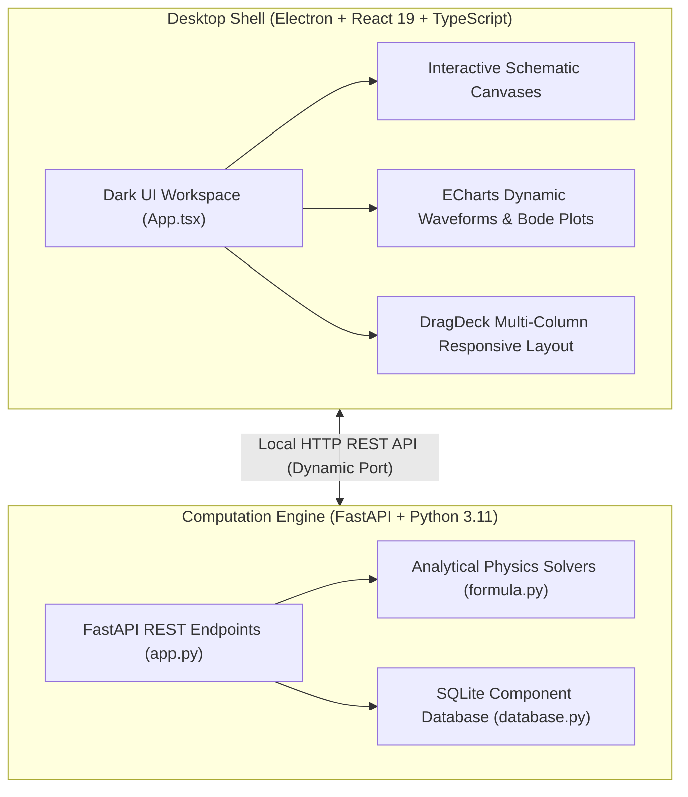

# Hardware Engineering Toolbox

<div align="center">


**An open-source desktop engineering toolbox for hardware and power electronics design.**

</div>

---

## About the Project

**Hardware Engineering Toolbox** is a desktop application created to assist hardware and power electronics engineers with routine design calculations. It combines analytical formulas, interactive schematic diagrams, waveform and Bode plots, and component databases into a single desktop interface.

### Note from the Author (Motivation & Current Status)

> I originally started developing this software to help with my own daily hardware and power electronics design work, aiming to avoid repeating the same calculations across spreadsheets and unverified online tools.
>
> The software currently includes 30 design workstations covering common power converters, magnetics, thermal analysis, loop compensation, and passive components. However, please note that the internal software architecture still has areas that can be improved, refactored, or cleaned up.
>
> Because I currently do not have the bandwidth or energy to continue active development and maintenance, I decided to open-source the project as-is. It is released under the MIT License so that anyone interested can use it for their work, study the implementation, fix issues, or continue developing and maintaining it.

---

## Features & Included Functions

The application includes 30 dedicated design workstations organized into five categories:

### 1. Power Converter Co-Design
- **Buck Synchronous Converter**: Input/output sizing, CCM/DCM inductor ripple, capacitor ESR ripple, Bode loop stability sweeps, and commercial BOM component selection.
- **Isolated Flyback Converter**: Continuous/discontinuous mode operation, reflected voltage Vor, primary inductance, turns ratio, RCD snubber clamping, and AP core sizing.

### 2. Magnetics & Inductor Design
- **Power Inductor Design**: Core geometry, air gap calculation, wire selection, Dowell high-frequency AC resistance factor Fr, and DC saturation check.
- **High-Frequency Transformer**: Forward, flyback, and LLC transformer sizing, AP method, window area fill factor, and leakage inductance estimation.
- **Core Loss Evaluation (iGSE)**: Non-sinusoidal volumetric core loss calculation using the Improved Generalized Steinmetz Equation with Steinmetz material coefficients.
- **Switch Snubber & Clamp**: RC snubber and RCD clamp calculations for ringing damping and peak voltage suppression.
- **DC-Link Capacitor Ripple & Lifetime**: Multi-phase interleaved and 3-phase inverter RMS ripple currents, ESR self-heating, and Arrhenius lifetime prediction.
- **3-Phase AC & Vector Transforms**: Star-Delta conversions, Clarke/Park transformations, and reactive power compensation.

### 3. Power Semiconductor & Thermal Analysis
- **Power Device Losses**: MOSFET and IGBT conduction loss, switching energy (Eon/Eoff), gate charge loss, and junction temperature estimates.
- **Gate Drive & Miller Verification**: Gate resistor sizing, parasitic Miller turn-on risk verification (SiC/GaN), and dead-time loss calculation.
- **Double Pulse Test (DPT)**: Inductive load charging pulse width, freewheeling diode reverse recovery, and energy overlap extraction.
- **Transient Thermal Networks**: Multi-stage Foster RC thermal impedance solver for pulse load temperature rise.
- **Heatsink Sizing**: Natural and forced convection thermal resistance estimation based on fin dimensions and airflow.
- **LDO Linear Regulator**: Thermal dissipation, dropout boundary, and minimum PCB copper area requirements.
- **Battery Pack & BMS**: Series/parallel pack configuration, internal resistance loss, and passive cell balancing.
- **System Power Budget**: Full-system efficiency breakdown and loss distribution tree.

### 4. Control Loops & Signal Conditioning
- **Analog Loop Compensation**: Type II and Type III op-amp compensators, optocoupler-isolated TL431 feedback networks, and crossover frequency tuning.
- **Digital PID Discretization**: S-domain to Z-domain difference equations using Tustin/Bilinear transforms with exportable C code.
- **Passive & Active Filters**: Butterworth, Chebyshev, and LC low-pass/pi filters with impedance matching and Middlebrook stability check.
- **EMC Filter Toolbox**: Common-mode and differential-mode attenuation, damping networks, and aperture shielding.
- **ADC Signal Conditioning**: Anti-aliasing RC filter bandwidth, input sampling charge bucket settling, and op-amp gain scaling.
- **Current Sense Shunts**: Shunt resistor sizing, thermal drift, Kelvin connection error, and current transformer burden resistor.
- **NTC Temperature Sizing**: Steinhart-Hart equation fitting, Beta constant calculation, and C lookup table generation.
- **PWM Controller Peripherals**: PWM DAC RC filter ripple, MCU timer dead-time register values, and analog oscillator timing networks.

### 5. Passives, Protection & Database
- **TVS & Zener Overvoltage Protection**: Surge energy absorption, clamping voltage ratio, and surge resistor sizing.
- **Input Protection & Bleeders**: Inrush NTC sizing, fuse I²t pulse withstand, and X-capacitor safety discharge resistors.
- **PCB Trace & Via Current Capacity**: IPC-2152 trace ampacity, temperature rise, and via parasitic inductance.
- **Winding Wire & Copper Busbars**: High-current copper busbar temperature rise and multi-strand Litz wire skin/proximity sizing.
- **Capacitor Lifetime & Derating**: Arrhenius thermal derating and multi-frequency ripple current summation.
- **Component & Core Database**: Embedded SQLite database of commercial MOSFETs, diodes, TVS devices, and magnetic core geometries.

---

## Technical Stack & Architecture



- **Frontend**: React 19, TypeScript, TailwindCSS, ECharts, KaTeX (LaTeX math rendering), Lucide Icons.
- **Desktop Shell**: Electron 30.
- **Backend Engine**: Python 3.11, FastAPI, NumPy, SciPy, Uvicorn.
- **Storage**: SQLite local database for component specs and core materials.
- **Test Coverage**: 217 automated unit tests via Pytest covering the analytical solvers.

---

## Quick Start (Development)

### Prerequisites
- Node.js >= 18.0.0
- Python >= 3.10 (3.11 recommended)

### One-Click Launch (Windows)
Double-click `start_dev.bat` in the root folder. It will start both the Python backend and Electron frontend.

### Manual Steps
```bash
# 1. Backend
cd Source_Code/backend
pip install -r requirements.txt
uvicorn app:app --port 8000 --reload

# 2. Frontend
cd Source_Code/frontend
npm install
npm run dev

# 3. Electron Shell
cd Source_Code
npm install
npm start
```

---

## Building the Executable

To build the standalone portable `.exe`:
```bash
# Step 1: Package Python backend with PyInstaller
cd Source_Code/backend
python package_backend.py

# Step 2: Package Electron desktop app
cd Source_Code
npm run dist
```
The resulting executable is generated at `Hardware_Engineering_Toolbox.exe` in the root directory (~96 MB).

---

## Automated Tests

Run the backend unit tests:
```bash
cd Source_Code
python -m pytest
```

---

## License

This project is licensed under the [MIT License](LICENSE).

## Author & Contact

- **Author**: [WenZhenJian-EE](https://github.com/WenZhenJian-EE)
- **Repository**: [https://github.com/WenZhenJian-EE/Hardware-Engineering-Toolbox-Desktop](https://github.com/WenZhenJian-EE/Hardware-Engineering-Toolbox-Desktop)
- **Feedback & Contributions**: Issues and pull requests are welcome. If you are interested in continuing development, feel free to fork the repository.
