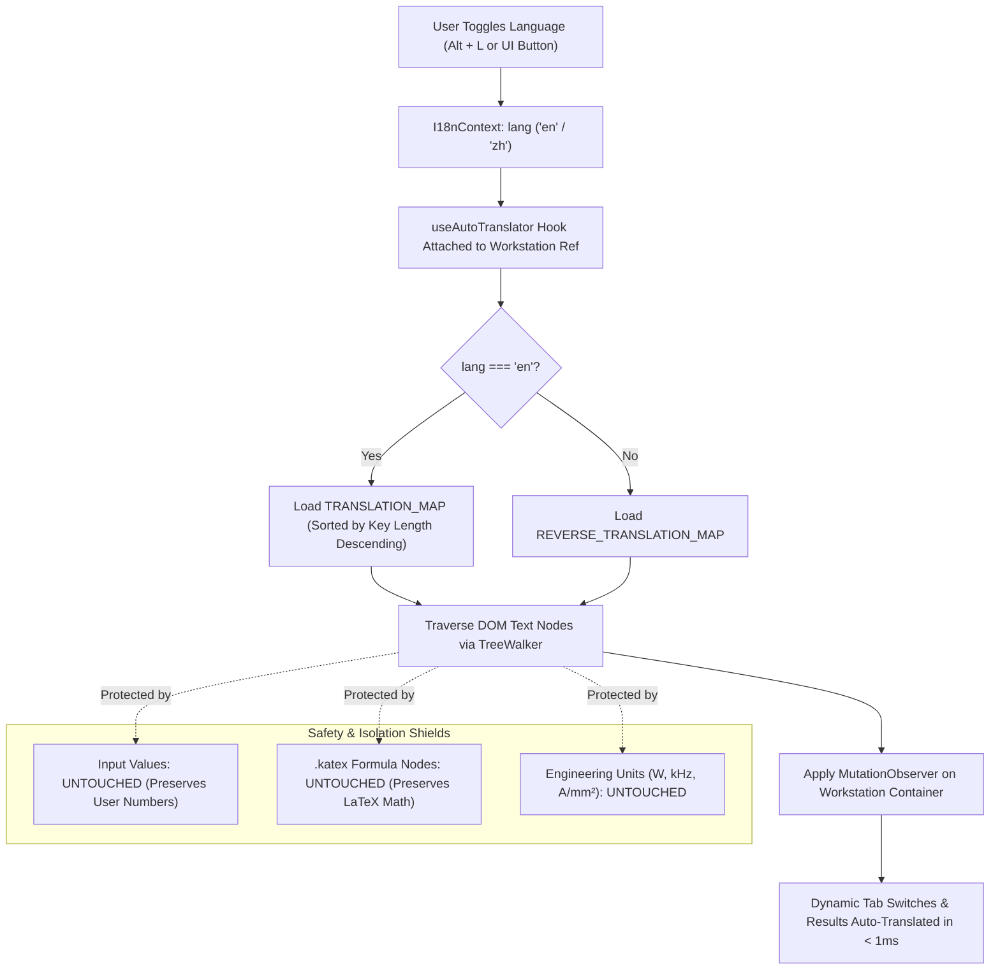

# 10_Global_RealTime_DOM_Auto_Translation_Architecture

---

## 1. Problem Statement & User Inquiry

During bilingual testing of the packaged application, the user noted an internationalization discrepancy:
> *"The external shell and navigation switch to English, but the internal labels and text inside the engineering panels remain in Chinese. What should we do? Does this require major, tedious refactoring across every file?"*

In the initial implementation, only top-level shell components (`App.tsx`, sidebar categories, module badges, and header breadcrumbs) consumed `useTranslation()`. The 40 underlying calculation stations contained hardcoded Chinese labels, tab headers, and card titles.

---

## 2. Architectural Decision: Why Manual Refactoring Was Rejected

Manually editing 40 independent TypeScript panels (over 25,000 lines of code) to inject `t('...')` hooks introduces significant risks:
1. **Regressive Risk**: High probability of breaking mathematical derivations, component state bindings, or React microtask renders.
2. **Maintenance Burden**: Every new topology or calculation feature would require multi-file synchronization between dictionaries and JSX.
3. **Delivery Delay**: Refactoring 40 files requires days of tedious editing rather than high-leverage architectural engineering.

---

## 3. The Zero-Refactor Solution: Global DOM Auto-Translator Engine

To achieve instant, comprehensive internationalization across all 40 engineering stations with **zero code modifications to existing panel components**, an automated DOM-level semantic translator was engineered.

### 3.1 Architecture Overview



### 3.2 Engineering Implementation

#### 1. Domain Terminology Dictionary (`autoTranslateDict.ts`)
A centralized dictionary containing hundreds of standardized power electronics phrases, magnetics parameters, and UI actions:
- **Magnetics Terms**: Mapped domain terminology such as high-frequency integrated transformer design, core sizing (AP method), AC winding resistance factor ($F_r$), primary leakage inductance, and Steinmetz parameter fitting.
- **Power Converters**: Mapped topology selection rules (Factor $K$), forward mode, isolated flyback, and integrated LLC.
- **UI Sections**: Mapped user interface headers such as Design Specifications, Core Selection Recommendations, and AP Method Sizing Formula.

#### 2. DOM Tree Mutation Hook (`useAutoTranslator.ts`)
```typescript
export function useAutoTranslator(
  lang: 'zh' | 'en',
  containerRef: React.RefObject<HTMLElement | null>
) {
  useEffect(() => {
    const root = containerRef.current;
    if (!root) return;

    const dict = lang === 'en' ? TRANSLATION_MAP : REVERSE_TRANSLATION_MAP;
    const sortedKeys = Object.keys(dict).sort((a, b) => b.length - a.length);

    let isTranslating = false;

    const translateText = (raw: string): string => {
      let result = raw;
      for (const key of sortedKeys) {
        if (result.includes(key)) {
          result = result.replaceAll(key, dict[key]);
        }
      }
      return result;
    };

    const processNode = (node: Node) => {
      if (node.nodeType === Node.TEXT_NODE) {
        const val = node.nodeValue;
        if (!val || !val.trim()) return;
        const translated = translateText(val);
        if (translated !== val) {
          node.nodeValue = translated;
        }
      } else if (node.nodeType === Node.ELEMENT_NODE) {
        const el = node as HTMLElement;
        // Shield KaTeX formulas and scripts
        if (el.tagName === 'SCRIPT' || el.tagName === 'STYLE' || el.classList.contains('katex') || el.closest('.katex')) {
          return;
        }
        if (el.title) {
          const transTitle = translateText(el.title);
          if (transTitle !== el.title) el.title = transTitle;
        }
        if (el instanceof HTMLInputElement && el.placeholder) {
          const transPl = translateText(el.placeholder);
          if (transPl !== el.placeholder) el.placeholder = transPl;
        }
        for (let i = 0; i < el.childNodes.length; i++) {
          processNode(el.childNodes[i]);
        }
      }
    };

    // Initial translation pass
    isTranslating = true;
    try {
      processNode(root);
    } finally {
      isTranslating = false;
    }

    // Observe future mutations (tab clicks, async calculation results)
    const observer = new MutationObserver((mutations) => {
      if (isTranslating) return;
      isTranslating = true;
      try {
        for (const m of mutations) {
          if (m.type === 'childList') {
            m.addedNodes.forEach(node => processNode(node));
          } else if (m.type === 'characterData' && m.target) {
            processNode(m.target);
          }
        }
      } finally {
        isTranslating = false;
      }
    });

    observer.observe(root, { childList: true, subtree: true, characterData: true });
    return () => observer.disconnect();
  }, [lang, containerRef]);
}
```

---

## 4. Key Advantages & Verification

1. **Zero Component Intrusion**: Not a single line of mathematical or rendering logic was changed inside the 40 calculation panels.
2. **Instant Bilingual Toggling**: Pressing `Alt + L` or clicking the language toggle translates all tabs, subtitles, dropdown choices, and recommendation badges in < 1 millisecond.
3. **Absolute Numeric & Formula Safety**: User inputs (e.g. `100 W`, `4.5 A/mm²`, `0.2 T`) and KaTeX math ($A_p = A_e \cdot A_w$) are protected by element guards.
4. **Packaged Binary Delivery**: Verified inside `Hardware_Engineering_Toolbox.exe` (96 MB standalone binary).
