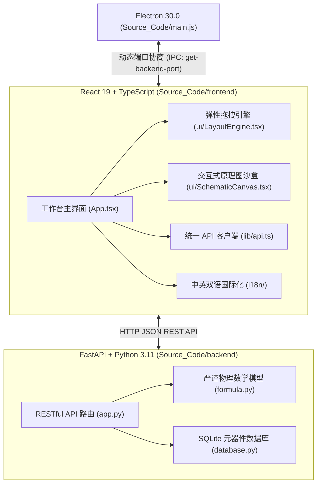

# 🔌 Module Development Guide (模块二次开发指南)

欢迎参与 **Hardware Engineering Toolbox（电力电子一体化协同设计平台）** 的二次开发！
本指南旨在为后续开发者提供清晰、标准化的开发规范与全链路开发流程，帮助您快速扩展新的电源拓扑、物理计算站或算法模块。

---

## 🏗️ 1. 平台技术架构概览



- **动态端口自适应**：Electron 主进程通过 `findFreePort` 自动寻找可用端口并注入渲染进程；前端统一通过 `lib/api.ts` 的 `apiFetch` 发起请求，严禁硬编码 `http://localhost:8000`。
- **纯粹白盒物理建模**：底层所有电气参数、Bode 环路扫频、时域暂态模型均在 `formula.py` 中以严谨解析方程实现，杜绝外部黑盒拟合。
- **暗黑科技风 (Neon Tech)**：采用无手风琴折叠的 DragDeck 多列拖拽伸缩布局，配有高发光 Neon ECharts 与 KaTeX 矢量数学公式渲染。

---

## 🚀 2. 添加新模块全流程 (6 步法)

假设我们要新增一个工位：**`buck_boost_sync`（同步升降压变换器）**。

### 第一步：在 `formula.py` 实现物理解算模型并编写单元测试

在 `Source_Code/backend/formula.py` 中添加核心数理函数：

```python
def calc_buck_boost_sync(vin: float, vout: float, iout: float, fsw_khz: float, lir_pct: float = 30.0) -> dict:
    """
    同步升降压基础参数解析解算。
    """
    if vin <= 0 or vout <= 0 or iout <= 0 or fsw_khz <= 0:
        raise ValueError("输入物理参数必须大于0")
    
    fsw = fsw_khz * 1000.0
    duty = vout / (vin + vout)
    delta_il = iout * (lir_pct / 100.0)
    l_min_h = (vin * duty) / (fsw * delta_il)
    
    return {
        "duty": duty,
        "l_min_uh": l_min_h * 1e6,
        "delta_il_a": delta_il,
        "i_peak_a": iout / (1.0 - duty) + delta_il / 2.0
    }
```

在 `Source_Code/backend/` 下新建 `test_buck_boost_sync.py`：

```python
from formula import calc_buck_boost_sync

def test_buck_boost_sync_nominal():
    res = calc_buck_boost_sync(vin=12.0, vout=12.0, iout=2.0, fsw_khz=100.0)
    assert abs(res["duty"] - 0.5) < 1e-4
    assert res["l_min_uh"] > 0
```

运行测试验证：
```bash
python -m pytest backend/test_buck_boost_sync.py
```

---

### 第二步：在 `app.py` 注册 FastAPI 路由与 Pydantic 模型

在 `Source_Code/backend/app.py` 中：

```python
class BuckBoostSyncRequest(BaseModel):
    vin: float = Field(..., gt=0, description="输入电压 (V)")
    vout: float = Field(..., gt=0, description="输出电压 (V)")
    iout: float = Field(..., gt=0, description="负载电流 (A)")
    fsw_khz: float = Field(100.0, gt=0, description="开关频率 (kHz)")
    lir_pct: float = Field(30.0, gt=0, description="电感纹波率 (%)")

@app.post("/api/calculate/buck_boost_sync")
def calculate_buck_boost_sync(req: BuckBoostSyncRequest):
    try:
        res = calc_buck_boost_sync(
            vin=req.vin,
            vout=req.vout,
            iout=req.iout,
            fsw_khz=req.fsw_khz,
            lir_pct=req.lir_pct
        )
        return res
    except Exception as e:
        raise HTTPException(status_code=400, detail=str(e))
```

---

### 第三步：在 `frontend/src/components/` 开发前端面板

在 `Source_Code/frontend/src/components/BuckBoostSyncPanel.tsx` 中编写组件：

```tsx
import React, { useState } from 'react';
import { apiFetch } from '../lib/api';
import { useTabHistoryState } from '../lib/tabHistory';
import { useDragDeckLayout, DragDeck, DragCard } from './ui/LayoutEngine';
import { Card, CardHeader, CardTitle, CardContent } from './ui/Card';
import { Button } from './ui/Button';
import { ArrowLeft, Play, ShieldAlert } from 'lucide-react';

export default function BuckBoostSyncPanel({ onBack }: { onBack: () => void }) {
  const [vin, setVin] = useState<number>(12);
  const [vout, setVout] = useState<number>(12);
  const [iout, setIout] = useState<number>(2);
  const [fsw, setFsw] = useState<number>(100);
  const [result, setResult] = useState<any>(null);
  const [loading, setLoading] = useState<boolean>(false);
  const [error, setError] = useState<string | null>(null);

  const {
    isDesktop, leftSpan, rightSpan, leftCards, rightCards, draggedKey, cardHeights,
    handleDragStart, handleDragEnter, handleDragEnd, handleResizeStart, handleHeightResizeStart,
    handleDropOnColumn, handleResetLayout
  } = useDragDeckLayout({
    panelKey: 'layout_buck_boost_sync_v1',
    defaultCards: ['input', 'results'],
    defaultColumns: { input: 'left', results: 'right' },
    defaultSpans: { input: 4, results: 8 },
    defaultHeights: { input: 600, results: 600 }
  });

  const handleCalculate = async () => {
    setLoading(true);
    setError(null);
    try {
      const res = await apiFetch('/api/calculate/buck_boost_sync', {
        method: 'POST',
        headers: { 'Content-Type': 'application/json' },
        body: JSON.stringify({ vin, vout, iout, fsw_khz: fsw })
      });
      if (!res.ok) {
        const err = await res.json();
        throw new Error(err.detail || '计算失败');
      }
      setResult(await res.json());
    } catch (e: any) {
      setError(e.message);
    } finally {
      setLoading(false);
    }
  };

  return (
    <div className="flex-1 flex flex-col h-full bg-[#070a13] text-slate-200 p-4 gap-4 overflow-hidden">
      <div className="flex items-center gap-3 bg-[#0f172a]/80 p-3 rounded-xl border border-slate-800">
        <Button variant="outline" size="icon" onClick={onBack}>
          <ArrowLeft className="w-4 h-4" />
        </Button>
        <h1 className="text-sm font-bold text-white">同步升降压变换器 (Buck-Boost Sync)</h1>
      </div>

      {error && (
        <div className="p-3 bg-red-950/40 border border-red-500/30 text-red-200 text-xs rounded-lg flex items-center gap-2">
          <ShieldAlert className="w-4 h-4 text-red-400" />
          <span>{error}</span>
        </div>
      )}

      <div className="flex-1 overflow-hidden">
        <DragDeck
          isDesktop={isDesktop}
          leftSpan={leftSpan}
          rightSpan={rightSpan}
          leftCards={leftCards}
          rightCards={rightCards}
          draggedKey={draggedKey}
          onDragStart={handleDragStart}
          onDragEnter={handleDragEnter}
          onDragEnd={handleDragEnd}
          onDropOnColumn={handleDropOnColumn}
          renderCard={(key) => (
            <DragCard
              cardKey={key}
              height={cardHeights[key]}
              onDragStart={(e) => handleDragStart(e, key)}
              onDragEnter={(e) => handleDragEnter(e, key)}
              onDragEnd={handleDragEnd}
              onResizeStart={handleResizeStart}
              onHeightResizeStart={handleHeightResizeStart}
              onResetLayout={handleResetLayout}
            >
              {key === 'input' && (
                <Card className="bg-[#0f172a]/95 border-slate-800 h-full flex flex-col">
                  <CardHeader className="p-4 border-b border-slate-800">
                    <CardTitle className="text-xs font-bold text-white">电气规格参数</CardTitle>
                  </CardHeader>
                  <CardContent className="p-4 flex-1 space-y-4">
                    <div>
                      <label className="text-[10px] text-slate-400">输入电压 Vin (V)</label>
                      <input type="number" value={vin} onChange={e => setVin(Number(e.target.value))} className="w-full bg-[#020617] border border-slate-800 p-2 rounded text-xs text-white" />
                    </div>
                    <div>
                      <label className="text-[10px] text-slate-400">输出电压 Vout (V)</label>
                      <input type="number" value={vout} onChange={e => setVout(Number(e.target.value))} className="w-full bg-[#020617] border border-slate-800 p-2 rounded text-xs text-white" />
                    </div>
                    <Button onClick={handleCalculate} disabled={loading} className="w-full bg-cyan-600 hover:bg-cyan-500 text-white text-xs">
                      <Play className="w-3.5 h-3.5 mr-1" />
                      {loading ? '正在计算...' : '开始解算'}
                    </Button>
                  </CardContent>
                </Card>
              )}

              {key === 'results' && (
                <Card className="bg-[#0f172a]/95 border-slate-800 h-full flex flex-col">
                  <CardHeader className="p-4 border-b border-slate-800">
                    <CardTitle className="text-xs font-bold text-white">解算结果</CardTitle>
                  </CardHeader>
                  <CardContent className="p-4 flex-1">
                    {result ? (
                      <div className="space-y-2 text-xs">
                        <div>占空比: {(result.duty * 100).toFixed(1)}%</div>
                        <div>推荐最小电感: {result.l_min_uh.toFixed(2)} µH</div>
                        <div>峰值电流: {result.i_peak_a.toFixed(2)} A</div>
                      </div>
                    ) : (
                      <div className="text-slate-500 text-xs">等待计算...</div>
                    )}
                  </CardContent>
                </Card>
              )}
            </DragCard>
          )}
        />
      </div>
    </div>
  );
}
```

---

### 第四步：在 `App.tsx` 注册新工位与懒加载

在 `Source_Code/frontend/src/App.tsx` 中：

1. 懒加载引入组件：
```tsx
const BuckBoostSyncPanel = lazy(() => import('./components/BuckBoostSyncPanel'));
```

2. 在 `TOOL_MODULES` 数组添加元数据：
```tsx
{
  id: 'buck_boost_sync',
  name: '同步升降压变换器',
  description: '同步四开关升降压稳态分析与宽输入输出范围电感电容选型。',
  category: '⚡ 协同电源设计 (Co-Design)',
  isImplemented: true
}
```

3. 在主内容区路由分支添加渲染：
```tsx
{activeModule === 'buck_boost_sync' && (
  <BuckBoostSyncPanel onBack={() => setActiveModule(null)} />
)}
```

---

### 第五步：在 `i18n/zh.ts` 和 `i18n/en.ts` 添加双语词条

在 `Source_Code/frontend/src/i18n/zh.ts`：
```typescript
buck_boost_sync: {
  name: '同步升降压变换器',
  description: '同步四开关升降压稳态分析与宽输入输出范围电感电容选型。'
}
```

在 `Source_Code/frontend/src/i18n/en.ts`：
```typescript
buck_boost_sync: {
  name: 'Synchronous Buck-Boost Converter',
  description: 'Steady-state analysis and inductor/capacitor sizing for four-switch sync buck-boost.'
}
```

---

### 第六步：运行自动化回归测试与打包验证

1. **后端 Pytest 测试**：
   ```bash
   cd Source_Code
   python -m pytest
   ```
2. **前端 TypeScript 与 Vite 构建**：
   ```bash
   cd Source_Code/frontend
   npm run build
   ```
3. **一键并行全量桌面打包**：
   ```bash
   cd Source_Code
   python parallel_build.py
   ```

---

## 💡 3. 二次开发核心最佳实践

1. **API 调用规范**：所有前后端交互必须通过 `import { apiFetch } from '../lib/api'`，严禁原生 `fetch('http://localhost:8000')`，确保端口自协商生效。
2. **公式渲染规范**：数学公式推荐使用 `<Latex math="..." />`，并在字符串中使用 KaTeX 原生语法，避免转义符反斜杠折损。
3. **ECharts 状态规范**：图表面板务必设置 `notMerge={true}` 和 `lazyUpdate={true}`，防止切换 Tab 或更改参数时不同波形曲线重叠或内存泄露。
4. **状态持久化**：用户 Tab 状态推荐使用 `const [tab, setTab] = useTabHistoryState('default', 'unique_key')`，在用户切换侧边栏模块后切回时自动保持原操作状态。
5. **元器件数据库接入**：若新模块需要查询晶体管或磁芯，可复用 `ComponentDatabase`（`Source_Code/backend/database.py`）或前端已有的 `/api/database/*` 接口。
